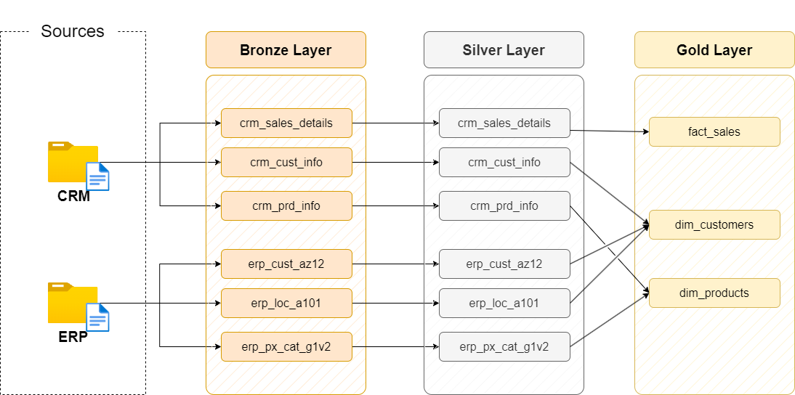

# Data Warehouse Project – Medallion Architecture (Bronze, Silver, Gold)

## Overview
This project demonstrates the design and implementation of a modern data warehouse using the medallion architecture approach. The pipeline ingests raw data from CSV files, transforms it through multiple layers, and delivers datasets modeled in a star schema that are ready for analytics.

The architecture is divided into three layers:
- **Bronze (raw Layer)**: ingest raw data from source systems  
- **Silver (clean Layer)**: data is cleaned, standardized and trandformed
- **Gold (business Layer)**: deliver analytical models (1 fact and 2 dimension views)

---

## Architecture

### Bronze Layer (raw data)
- Data is ingested directly from CSV files into SQL tables  
- No transformations are applied (the data is stored as it is)  
- Allows for traceability

#### Implementation:
- Used 'BULK INSERT' for high-performance data loading  
- Truncated tables before each load to maintain consistency  
- Designed staging tables for CRM and ERP source systems  

---

### Silver Layer (clean, transformed data)
- Data is cleaned, standardized, and enriched  
- Business logic and transformations are applied  

#### Transformations used:

**Data cleaning**
- Removed duplicates using 'ROW_NUMBER()' window functions  
- Handled NULLs, invalid values and missing data  
- Trimmed unwanted spaces using 'TRIM' 

**Data standardization**
- Normalized categorical values (e.g. gender and marital status)  

**Data transformation**
- Derived new columns (e.g. category ID from product key) 
- Calculated missing or incorrect values (e.g. sales, price)  

**Temporal logic**
- Generated 'prd_end_dt' using window functions ('LEAD')  

---

### Gold Layer (business-ready data)
- Data is modeled into a star schema for analytics  
- Implemented using views instead of physical tables  

#### Models:

**dimensions**
- dim_customers
- dim_products

**fact table**
- fact_sales

#### Key features:
- Surrogate keys using 'ROW_NUMBER()'
- Joined multiple sources for enriched dimensions  
- Applied business logic (e.g gender fallback from ERP if missing in CRM)  
- Filtered historical data for current state analysis  

---

## Skills & Concepts Demonstrated

### Data Engineering
- ETL pipeline design and implementation  
- Medallion architecture (bronze / silver / gold)  
- Data ingestion from flat files  

### SQL & Data Transformation
- Window functions ('ROW_NUMBER', LEAD')  
- Data cleaning techniques  
- Data type casting and validation  
- Handling NULLs and missing data  
- Derived columns and calculations  

### Data Modeling
- Star schema design  
- Fact and dimension tables  
- Surrogate key generation  

### Data Quality
- Duplicate removal  
- Data validation rules  
- Handling inconsistent and invalid data  

### Performance & Optimization
- Bulk loading ('BULK INSERT')  
- LEFT JOINs

---

## Tools Used

- SQL Server (ssms)
- draw.io for building diagrams and charts
